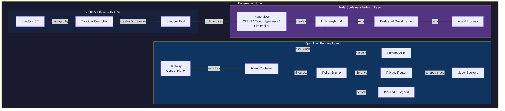
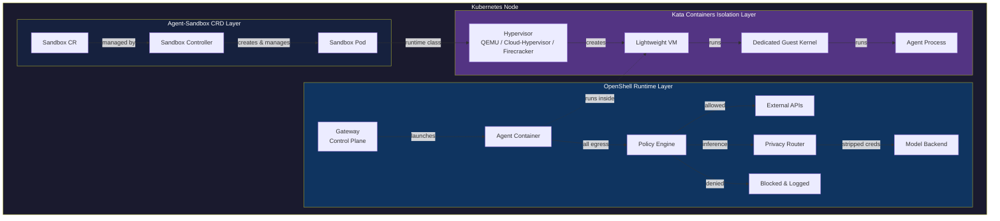
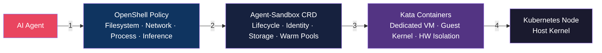
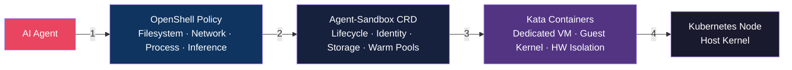

# Agent Sandboxing Layers in Kubernetes

## NVIDIA OpenShell

OpenShell is a safe, private runtime for autonomous AI agents. It wraps each agent session in a sandboxed container governed by declarative YAML policies that control filesystem access, network egress, process capabilities, and inference routing. A lightweight gateway acts as the control plane, managing sandbox lifecycle, while a policy engine intercepts every outbound connection -- allowing, denying, or rerouting it through a privacy-aware inference router. Policies for filesystem and process constraints are locked at creation; network and inference policies can be hot-reloaded at runtime. OpenShell supports Docker, Podman, MicroVM, and Kubernetes as compute backends.

## Agent-Sandbox (Kubernetes SIG Apps)

Agent-Sandbox is a Kubernetes-native project under SIG Apps that introduces a `Sandbox` Custom Resource Definition (CRD) and controller. It provides a declarative API for managing isolated, stateful, singleton pods with stable identity and persistent storage -- a lightweight single-container VM experience built on Kubernetes primitives. The controller handles pod lifecycle including creation, scheduled deletion, pausing, and hibernation. Extension CRDs (`SandboxTemplate`, `SandboxClaim`, `SandboxWarmPool`) enable templated creation and pre-warmed pools for fast allocation. Agent-Sandbox is runtime-agnostic and explicitly supports plugging in stronger isolation backends like gVisor or Kata Containers.

## Kata Containers

Kata Containers is an open-source container runtime that provides VM-level isolation while maintaining the developer experience and performance profile of standard containers. Each container (or pod) runs inside its own lightweight virtual machine with a dedicated kernel, using hardware virtualization extensions (Intel VT-x, AMD-V) as a second layer of defense. It is OCI-compatible and integrates with the Kubernetes CRI interface via containerd, supporting hypervisors including QEMU, Cloud-Hypervisor, and Firecracker. Kata provides isolation of network, I/O, and memory without requiring nested VMs.

---

## How Each Layer Sandboxes an Agent

Mermaid source

### Layered Defense Model

Mermaid source

| Layer | Scope | Isolation Mechanism |
|---|---|---|
| **OpenShell** | Application | YAML policies enforcing L7 network rules, filesystem ACLs, process restrictions, and inference routing |
| **Agent-Sandbox** | Orchestration | Kubernetes CRD managing pod lifecycle, stable identity, persistent storage, hibernation, and warm pools |
| **Kata Containers** | Runtime | Hardware-virtualized micro-VM with dedicated kernel, providing memory, I/O, and network isolation via VT-x/AMD-V |
